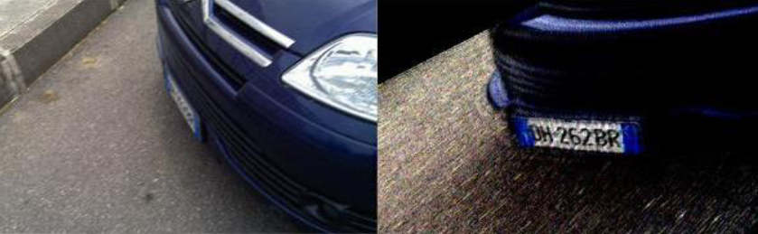
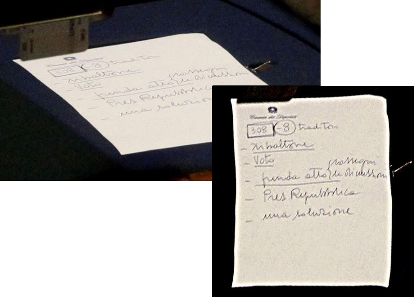
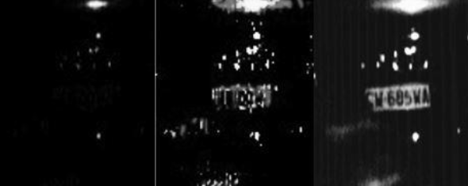
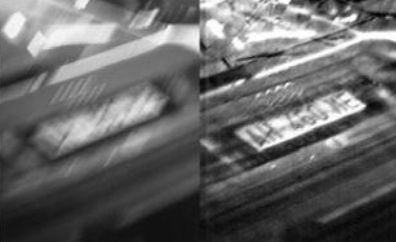

**Cosa è la Digital Forensics**
è la parte della scienza, che viene usata dall'esperto in materia, per la produzione di prove scientifiche nella legge. Questa disciplina ha diversi limiti come : 
- Alterazione dei reperti;
> possono essere modificati accidentalmente o comunque possono essere creati degli elementi di prova ad hoc.
- Riconducibilità della traccia informatica ai soggetti e necessità di trovare riscontri;

la disciplina si divide in :
- *Database Forensics*;
- *Network Forensics*;
- *Mobile Forensics*;
- *Data Analysis Forensics*;
- *Computer Forensics*
- *Multimedia Forensics*;

in ognuno di questi campi, l'esperto forense deve occuparsi di mantenere $l'integrità^1$ del $dato^2$, ovvero l'individuazione, la conservazione, protezione ed estrazione dei dati, di verificare $l'autenticità^3$ di un dato e di fornire una documentazione e attraverso la prova di $resistenza\text{ }Giudiziaria^4$ potrà confermare le proprie conclusioni, per far si che la figura dell'esperto forense espleti al meglio la sua funzione si usano delle *best practice* dettate da dei protocolli, tipo il protocollo ISO. nel campo della Digital Forensics si riconoscono 5 fasi e sono : 
- *identificazione*;
- *Acquisizione*;
- *Analisi*;
- *Valutazione*;
- *Presentazione*;

**Evidenze Digitali**
l'esame di prove digitali deve essere fatta in maniera accurata e metodica, solitamente si crea una copia dell'originale in maniera tale che non vi sia un alterazione del reperto, una volta che un evidenza viene trovata bisogna seguire una $catena\text{ }di\text{ }custodia^5$.

**Identificazione**
è la fase che serve per rilevare cosa è utile per l'indagine.

**Acquisizione**
è la fase dove ci occupiamo della copia completa bit-a-bit, in questa fase dobbiamo stare attenti a non contaminare le prove, viene usata la tecnica di $imaging^6$, si realizzano più copie, una copia master e alcune per le parti coinvolte nel processo, in maniera da poter restituire i dispositivi ai proprietari.
Dobbiamo mettere in atto procedure di verifica ed autenticità dei dati, per fare ciò vengono usati i digest che sono ottenuti tramite $funzioni\text{ }HASH^7$, queste funzioni sono NON iniettive e quindi non è possibile risalire all'originale conoscendo solo il digest, useremo 2 tipi di funzioni HASH e sono : 

- MD5;
> Message Digest algorithm 5, prende in input una stringa di lunghezza arbitraria e ne produce un'altra da 128bit, due input differenti daranno 2 output differenti
- SHA;
> Secure Hash Algorithm indica una famiglia di algoritmi che contiene :
>    - SHA-1
>    - SHA-224
>    - SHA 256
>    - SHA-384
>    - SHA-512

il numero specificato nel nome dell'algoritmo specifica la lunghezza in bit dell'output.

**Analisi**
in questa fase dobbiamo rendicontare TUTTO ciò che troviamo e tutto ciò che facciamo, viene effettuata su una copia dei dati e deve essere *riproducibile*.

**Valutazione**
si interpretano i dati studiati in fase di analisi.

**Presentazione**
si raccontano tutte le fasi precedenti adattando il lessico da usare, e traendo le conclussioni.

### Dispositivi di Memorizzazione
la memorizzazione degli Hard-Disk avviene in 2 livelli :
- fisico;
- logico;

la memorizzazione dei file dipende dal tipo di file system che si utilizza nel dispositivo di archiaviazione, ogni produttore ha le proprie tecniche di memorizzazione per bypassare questo problema si può usare un dispositivo di massa uguale in maniera che si può fare la copia e la lettura, molto spesso i file system non memorizzano in maniera contigua i dati ma sono frammentati in blocchi associati tra loro tramite l'indirizzamento.
La cancellazione dei dati avviene in due forme :
- rimozione dell'informazione di indirizzamento senza la cancellazione effettiva del dato fin quando quella parte di memoria non viene sovrascritta.

- rimozione tramite software di wiping che sovrascrivono i file e la loro informazione di indirizzamento.

quando viene cancellato un file rimuovendo solo l'informazione di indirizzamento si può ancora recuperare il file, o in maniera completa o parziale.

### Correzione Prospettica
è una tecnica geometrica utilizzata in Informatica Forense per prendere informazioni che sono presenti nell'immagine ma non sono chiari, ecco alcuni esempi :

Es1.(Targa dell'auto blu nelle slide)

in questo esempio si è recuperata una targa che era stata acquisita con una cattiva angolazione, tramite Correzione Prospettica si è riuscita a ricavare la targa vera.

Es2.(foglio sul tavolo)

in questo esempio viene recuperata un informazione importante in un banco di un senatore in parlamento che faceva conti che servivano per la sfiducia di uno dei governi Berlusconi.

### Caratteristiche Minime
in Informatica Forense e soprattutto nello studio delle immagini, non vi è un vero e proprio limite minimo, perchè si è vincolati dalla risoluzione delle videocamere di sorveglianza che sono a bassa risoluzione e con un frame rate inadatto, un frame rate migliore porta ad avere meno problemi di qualità.

### Fattibilità del Miglioramento
il miglioramento può essere effettuato usando anche i fotogrammi successivi, questo processo viene chiamato operazione di integrazione e praticamente si suppone che ogni fotogramma abbia una parte di informazioni e quindi sovrapponendo i fotogrammi potrebbe uscire fuori un dettaglio nuovo e rilevante.

Es.

viene recuperata la targa perchè vi erano abbastanza fotogrammi da poter usare per migliorare l'immagine e trovare il dettaglio interessato ovvero la targa.

Es2

in questa foto abbiamo del motion blur lineare, riconoscibile dalla presenza di strisciate nel rumore, in questo caso il blur sarà invertibile entro un certo limite, mentre fosse stato del blur puro dovuto ad una funzione isotropa non si potrà mai migliorare.

### Super Resolution
Sono degli algoritmi che imparano, prendono N immagini di volti dove si ha il dettaglio ad alta risoluzione o bassa risoluzione, stimano un campione andando a fare il match con la banca dati. 
Purtroppo non è possibile usare questi algoritmi in quanto necessitano l'utilizzo di un AI, questa non è ancora stata regolamentata in ambito giuridico pertanto per fare il riconoscimento del sospettato deve esserci l'agente fisico.

## La Consulenza Tecnica
La relazione della Consulenza Tecnica deve essere presentata in forma cartacea con firma olografa, solitamente la tempistica e i metodi di consegna vengono concordati, se si sfora il tempo di consegna vi è una riduzione della paga finale.

### Obiettivo
Rispondere al quesito tecnico richiesto.

### Elementi della Consulenza
- Estremi del procedimento e ruoli 
> qui si associa un numero di procedimento al rispettivo procedimento e si determinano i ruoli.
- Testo del Quesito
> Quesito che il Tecnico deve studiare, sarebbe buona norma che il PM/Giudice o chiunque voglia chiamare il tecnico ne parli prima col tecnico in maniera da poter scrivere un quesito coerente con il procedimento.
- Premesse Tecniche
> Guida dei termini e di cosa si fa.
- Dati di Lavoro
> Si descrive nel dettaglio tutta la procedura di studio dall'acquisizione
- Metodologia
> Si descrive in maniera dettagliata cosa si è fatto nel processo di studio e come si è lavorato.
- Analisi Tecnica
> Si descrive cosa si fa con i dati ed il fine ultimo dell'analisi riportando anche ciò che trovo, rispondendo così al quesito.
- **Conclusioni**
> Riporto i risultati finali dell'analisi.
- Allegati Tecnici
> Dati che potrebbero essere utili al fine del quesito, nella relazione si aggiungono anche i relativi HASH.(potremmo pure utilizzare un unico file excel che associa i vari HASH ai file e nelle conclusioni andremo poi ad aggiungere il nome del file e il relativo HASH per garantirne autenticità)

Come allegati possono valere : 
- CV del Consulente Tecnico
- Copia in formato pdf della relazione
- Tutti i documenti Digitali con relativo HASH.

### Forma del Documento e Presentazione
Deve essere utilizzato un linguaggio e uno stile adeguato agli attori senza omettere dettagli importanti, durante la presentazione è meglio fare riferimenti alla Consulenza Tecnica e soprattutto bisogna leggere le conclusioni e durante l'esposizione dovrebbe essere semplice, chiara, completa, professionale ed inoltre si dovranno presentare anche eventuali verbali delle operazioni compiute.

## Pillole di Diritto

### Falsa Perizia
Al pari della Falsa Testimonianza se un Perito dichiara il falso sarà punito con la reclusione, inoltre sarà radiato dall'albo dei periti di cui fa parte.

### Frode Processuale
La frode processuale è un termine generico che si riferisce a qualsiasi comportamento fraudolento o ingannevole messo in atto durante un procedimento giudiziario, sia esso civile, penale o amministrativo. Secondo l'articolo 374 del Codice Penale italiano:
    Art. 374 – Frode processuale

    Chiunque, nel corso di un procedimento civile, penale o amministrativo, con l'inganno induce in errore il giudice o altro pubblico ufficiale per far conseguire a sé o ad altri un profitto ingiusto o per arrecare ad altri un danno, è punito con la reclusione da uno a cinque anni.

### Frode Processo Penale
La frode nel processo penale è una specifica applicazione della frode processuale, mirata esclusivamente ai procedimenti penali.

## Perquisizione Informatica
La perquisizione è un mezzo di ricerca della prova a sorpresa, al fine di rintracciare il corpo del reato, vi sono 2 tipi di perquisizioni : 
1) Perquisizione Personale
>  la ricerca della prova sarà svolta sull'indiziato
2) Perquisizione Locale
> la ricerca della prova sarà svolta sul luogo dove è registrata la residenza/domicilio

durante le operazione di indagini preliminari è disposta dal PM, in informatica la perquisizione può essere effettuata solo se si trova una prova di flagranza di reato, per tanto la polizia giudiziaria e i consulenti dovranno occuparsi tempestivamente di isolare i sistemi dalla rete.

### Strumentazione
un kit di Strumenti da usare durante una perquisizione/perizia potrebbero essere : 
- Varie Memorie di Massa
- HW per la duplicazione forense dei dati
- HW/SW per bloccare la scrittura su memorie collegate
- Distro Linux
- SW per l'acquisizione di file da dispositivi mobili
- SW per l'acquisizione su cloud
- SW per il download delle mail
- Kit di cacciaviti e strumentazioni per smontare e rimontare i dispositivi.

## Ispezione Informatica
Serve a cercare delle prove o comunque delle tracce, una volta trovato qualcosa viene acquisito in maniera forense ed avviene previa comunicazione con l'interessato, esistono due tipi di ispezione :
- Ispezione Personale
> la ricerca della prova sarà svolta sull'indiziato
- Ispezione Locale
> la ricerca della prova sarà svolta sul luogo dove è registrata la residenza/domicilio

# Acquisizione e trattamento dati informatici in Rete
l'acquisizione e il trattamento dei dati informatici in rete sono dei processi critici per raccogliere e analizzare prove digitali. La digital forensics è una disciplina che si occupa di identificare, preservare, analizzare e documentare dati informatici per scopi legali. Ecco una guida dettagliata sulle fasi e le migliori pratiche durante un'indagine di Digital Forensics:

## Diffamazione in Rete
La rete in particolare i Social Network sono diventati ormai la casa di molte persone, perchè milioni di persone interagiscono con gli altri scambiandosi foto, opinioni, commenti e informazioni, l'azione più semplice che uno può compiere ovvero esprimere un proprio pensiero può essere a volte può racchiudere insiedie e conseguenze anche di natura penale, questo perchè l'art 595 comma terzo del codice penale punisce ogni offesa recata col mezzo della stampa o qualsiasi altro mezzo di pubblicità, per sussistere il Reato di Diffamazione devono rispettarsi alcuni requisiti :
- Assenza dell'offeso (Se l'offeso è presente durante l'ingiuria diventa reato di ingiuria)
- Offesa all'altrui reputazione
- Comunicazione a più persone
questi requisiti sono da estendersi anche alla Diffamazione in rete.

la certificazione di una presunta diffamazione in rete deve includere la fase di acquisizione delle prove, la certificazione dell'integrità dei dati e la stesura di una relazione tecnica. La consulenza finalizzata a documenta tramite prove informatiche la diffamazione e l'ingiuria avvenuta in rete può essere estesa tramite indagini e ricerche OSINT, per prendere il colpevole non bisogna stampare su carta la prova, non bisogna andare dal notaio a farsi certificare la stampa bensì è meglio applicare i seguenti passi :

- Identificazione del profilo, tramite tool tipo findmyfbid.com bisogna trovare il codice di riconoscimento associato a quella pagina/profilo, in questa maniera stiamo rendendo rintraciabile il profilo/pagina in qualsiasi caso anche se vengono cambiati i dati.
- si deve congelare anche il link al posto/commento diffamatorio.
- è buona norma attivare le notifiche per il post di interesse.

## Acquisizione di pagine web
in caso di acquisizione forense di un sito, siamo nel campo del Network Forensics, bisogna cristallizzare il sito di nostro interesse in modo da recepire tutti gli oggetti quali certificati SSL e tutti gli altri elementi a testimoniare che su un determinato sito era attiva una determinata pagina, un software gratuito per fare ciò è **FAW** che permette di fare un acquisizione e tenerla privata per l'utente che la effettua oppure la si può caricare sui server FAW in maniera tale che si possono esseguire verifiche on-line dell'integrità dell'acquisizione, altre utilità di questo genere gratuite ma su internet sono :
- archive.is
- Perma.cc

Utilizzando FAW il processo di acquisizione è il seguente :

$Acquisizione\text{ }Immagine\text{ }della\text{ }Pagina\text{ }Web \rightarrow Headers \rightarrow Codice\text{ }HTML\text{ }di\text{ }Tutta\text{ }la\text{ }pagina \rightarrow altri\text{ }oggetti\text{ }contenuti\text{ }nella\text{ }pagina\text{ }se\text{ }selezionati\text{ }in\text{ }fase\text{ }di\text{ }config$

il tutto verrà poi immagazzinato in una cartella usando i seguenti nominativi :
- Acquisition.log 
> qui troviamo tutte le operazioni effettuate da FAW
- Acquisition.txt
> Qui troviamo tutti i riferimenti dell'acquisizione
- Acquisition.xml
> Qui troviamo tutti i rifimenti dell'acquisizione ma secondo lo standard DFXML
- Code.html
> Qui troviamo tutto il codice della pagine Web
- CodeFrame.html
> Se esiste un frame qui troveremo il codice del frame HTML
- Headers.txt
> Qui troviamo tutti gli headers della pagina
- Hosts
> Qui troviamo la copia del file hosts al momento dell'acquisizione della pagina.
- Image.png
> è l'immagine della pagina web creata con la Gold Box ed è in formato pndg a 24bit
- Image{numero}.png
> sono porzioni del file immagine della pagina che vengono ritagliate con un aspect ratio di 1,41 in maniera che siano adatte alla stampa su fogli A4
- SystemLogEvent.txt
> Qui troviamo tutti gli eventi registrati dal SO durante l'acquisizione della pagina web
- screenCapture.wmv
> Questo è un report visivo ovvero una registrazione dello schermo dall'inizio della procedura alla fine.
- WireShark.pcap
> è il file creato tramite wireshark per acquisire il traffico di rete avvenuto durante l'acquisizione della pagina
- Cartella Objects
> Qui troviamo tutti gli elementi della pagina web acquisiti e numerati progressivamente con formato {nnnn}nomefile.ext

Ai fini legali i file che ci interessano saranno i file Acquisition.xml o Acquisition.txt, per tanto questi due file dovranno essere firmati digitalmente e dovranno avere anche una marca temporale in maniera da certificare la data di acquisizione

### Marca Temporale
sono delle tecniche per la generazione, apposizione e verifica della validazione temporale di documenti informatici, mediante un marcatore temporale stiamo andando a dire che quel determinato file dove vi è il marcatore temporale siamo certi della sua collocazione temporale e dal momento scritto nel marcatore sarà valido legalmente, una marca temporale nel suo algoritmo deve tenere conto delle seguenti cose :
- Identificativo dell'Ambiente
- Numero di Serie della Marca Temporale
- Algoritmo di sottoscrizione della marca temporale
- Identificativo del Certificato
- Riferimento temporale della generazione
- Identificativo della funzione HASH
- Valore dell'impronta dell'evidenza informatica.

con la Marca temporale quindi si appone data e ora sull'oggetto/file in maniera che possa valere ai fini legali, questo servizio può essere applicato anche su file non firmati digitalmente, garantendo la loro collocazione temporale ed ovviamente può essere apposto a posteri su documenti che godono già di una firma digitale, in questa maniera se la marca temporale viene apposta prima della scadenza del firma questo preciso file sarà valido ai fini legali anche dopo la scadenza della firma.

### Social Network
sono tutti quei servizi che permettono la creazione di una rete sociale virtuale.
- Instagram
- Facebook
- TikTok
- Pinterest
- Ask.fm
- YT

## La Posta Elettronica
è una comunicazione asincrona tra due o più individui che viene effettuata tramite un server che raccoglie la posta e poi alla connessione del client interessato la notifica.

$Client1 \rightarrow Server \rightarrow Client2$

una e-mail è formata da un involucro e dal corpo del messaggio, nel corpo troviamo l'header e il testo della mail, nelle e-mail si fa uso del protocollo RFC 1341 (MIME)che definisce la descrizione di file di testo per il corpo della mail e la descrizione dei file multimediali. Nell'header dell'e-mail alcuni server potrebbero rilasciare un DKIM sulla mail al fine di tenere traccia di qualem e-mail è passata da loro.

per lo studio forense si hanno due possibilità :
- Accesso via Webmail
> si effettua una copia forense del sito.
- Accesso via Client-Mail
> si effettuano le copie forensi del client in locale.

Tools per fare analisi di e-mail :
- Email Tracker

## Investigazione su immagini/video
la procedura per investigare su immagini o video deve preservare il file multimediale, deve documentare tutti i passi dell'elaborazione, inoltre deve grantire che l'immagine elaborata sia riproducibile seguendo i passi descritti nella documentazione.

### Cenni sulle immagini digitali
le immagini sono raffigurate mediante una funzione 2D f(x, y), questa rappresenta una misura opportuna di uno o più caratteristiche(Colore, Movimento, Profondità) di una data scena, esistono diverse tipologie di immagini, ma quelle che interessano a noi sono le immagini digitali, queste per essere rappresentate devono essere campionate e quantizzate in maniera tale da poterle rappresentare in una matrice I (Costituita da M*N pixel con valore nell'intervallo [0, L-1])con un numero discreto di campioni. I valori che rappresentano il pixel[i][j] sono i livelli possibili di intesità o di grigio. è possibile migliorare l'aspetto di un immagine tramite una LUT.

### Immagini RGB
Per descrivere un immagine RGB, basterà mischiare i tre colori principali Rosso, Verde, Blue con contributi indipendenti l'uno dall'altro. Nel grafico del modello di colore basterà tirare una linea e quella linea darà tutte le combinazioni dei 3 colori.

### Istogrammi
Un istogramma è quel diagramma che tramite una serie di barre dette bin va a rappresentare i livelli di grigi di un immagine digitale, guardando l'istogramma potremmo capire quando una immagine è stata modificata, se è sovraesposta/sottoesposta, se è stato migliorato il contrasto perchè avremo diverse tipologie di istogramma :
- Bin densi a destra = immagine sovra-esposta
- Bin densi a sinistra = immagine sotto-esposta
- Bin disposti al centro = immagine a basso contrasto
- Bin disposti in maniera omogenea = immagine equalizzata

N.B. se due immagini hanno lo stesso istogramma non vuol dire che siano la stessa immagine, l'istogramma non da informazioni sul come sono disposti i pixel nella matrice.

### Contrast-Enhancement
è possibile giocare con il contrasto tramite l'utilizzo delle LUT, per ottenere l'effetto "Espansione del Contrasto" si vanno a spostare i bin occupati al posto di bin non occupati allargando l'intervallo di intensità dei pixel dell'immagine. Abbiamo delle applicazioni pratiche in medicina per migliorare la visibilità nelle radiografie oppure 

### Equalizzazione
l'equalizzazione è quel processo che va ad appiattire il nostro istogramma, in questa maniera si va a migliorare il contrasto perchè si modifica la distribuzione dei valori in modo che l'istogramma risulti uniforme su tutto l'intervallo.

### Color Correction
è una tecnica utilizzata per migliorare la qualità visiva delle immagini e dei video digitali. 

### Filtraggi Convolutivi
sono quella tipologia di filtri che si applicano usando una maschera detta kernel i cui valori definiscono il comportamento del filtro. In base alla grandezza del kernel riconosciamo 2 tipi di Filtri :
- Filtri Quadrati
- Filtri Rettangolari

### Filtri Quadrati
sono tutti quei filtri utilizzati con un kernel di risoluzione NxN

### Filtri Rettangolari
sono tutti quei filtri utilizzati con un kernel di risoluzione MxN con $M \neq N$

### Filtro di Media
È un filtro non lineare utilizzato per rimuovere il rumore dalle immagini, si prendono i valori di una finestra di pixel intorno ad un pixel di interesse, il valore centrale sarà la mediana e sarà sostituita al valore originale del punto di interesse, i valori intorno saranno posti in ordine crescente.

### Miglioramento delle immagini generale vs miglioramento delle immagini forense
nel miglioramento delle immagini normale l'obiettivo è quello di migliorare l'aspetto visivo anche usando tecniche lossy, mentre in ambito forense si vuole il compromesso migliore tra perdere informazioni e migliorare l'immagine questo perchè il processo deve essere ripetibile ed attendibile. Per migliorare le immagini è meglio lavorare nel dominio di fourier ovvero quello delle frequenze, in maniera tale che se il disturbo inserito è di tipo periodico si può eliminare facilmente.

### Zoom : Interpolazione Bicubica vs Adattiva
l'interpolazione è quella funzione che serve a riempire i pixel con valori conosciuti, in questo corso studiamo lo zoom adattivo o con interpolazione bicubica, lo zoom adattivo è più adatto per migliorare i bordi del soggetto dell'immagine, mentre se vogliamo ancora più qualità è meglio usare la bicubica.

### Codifica : Formati delle immagini/video e loro compressioni
Esistono svariati formati per immagazzinare i nostri file multimediali, alcuni lossy e sono : 
- JPEG
- J2K
e altri lossless :
- BMP
- GIF
- PNG
- TIFF
- PPM/PGM
- RAW

poi vi sono formati proprietari che sono molto spigolosi perchè non sono standard ma hanno caratteristiche scelte dalla casa produttrice.

è bene sottolineare la differenza tra compressione lossy = durante la compressione si utilizzano algoritmi che fanno perdere informazioni al file.
Compressione lossless = durante la compressione si utilizzano algoritmi che preservano i dati e non fanno perdere informazioni al file.

### Deblocking : Cosa è?
sono quegli algoritmi che vanno a migliorare un immagine affetta da blocking, ovvero si vedono i quadrati dei pixel nell'immagine al posto di vedersi nitide e morbide.

N.B. per migliorare un immagine è importante rispettare l'ordine in cui si applicano i filtri, ovvero in caso di blocking avvenuto per colpa della compressione(Quindi ultimo passaggio prima del mio studio), prima miglioro dl'artefatto dovuto alla compressione e poi miglioro l'immagine.

## Image enhancement
sono un insieme di tecniche utilizzate per migliorare la qualità visiva delle immagini digitali con l'obiettivo di rivelare dettagli nascosti o non facilmente visibili.

## Image Restoration
è un processo utilizzato per recuperare un'immagine degradata riportandola il più vicino possibile al suo stato originale. 

### Glossario dei Termini
1) Integrità = il termine viene utilizzato per indicare che il dato è originale.
2) Autenticità = il termine viene utilizzare per indicare che il dato è una riproduzione accurata dell'evento;
3) Dato = è una qualsiasi informazioni digitale che può servire in un caso;
4) Resistenza Giudiziaria = ;
5) Catena di Custodia = catena di come un dato viene usato.;
6) Imaging = ;
7) Funzioni Hash = è una Funzione non invertibile che mappa un dato di lunghezza variabile in una stringa a lunghezza predefinita;