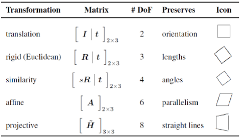

### Filtri di Deconvoluzione
sono quei filtri che si applicano mediante la funzione inversa dell'effetto che vogliamo levare.

### Effetto di Blurring
l'effetto di sfocatura solitamente è impossibile invertire, ma se si conoscono i parametri che hanno dato vita alla sfocatura, possiamo invertire lo sfocamento, stessa cosa vale per la sfocatura di movimento, se il moto che ha introdotto la sfocatura è lineare e si riesce a capire quale sia la funzione possiamo invertire la sfocatura.

### Effetto di interlacciamento
esistono diversi tipi di deinterlacciamento e possono essere :
- deinterlacciamento lineare
> Questa tecnica era largamente utilizzata ai tempi degli schermi a tubo catodico. Ogni fotogramma viene diviso in 2 campi, uno contenente le linee dispari e l'altro pari in ognuno dei due campi viene applicata dell'interpolazione lineare ed infine i due campi con l'interpolazione effettuata vengono combinati per ottenere un frame progressivo completo.
- deinterlacciamento adattivo
> Questa tecnicamente è molto più efficiente della precedente perchè si deve analizzare il movimento tra i campi del video e andare a capire dove sia effettivamente il movimento, successivamente si possono applicare tecniche differenti per la combinazione tra i campi statici e dinamici, infine si applica un filtro adattivo.
- dividere l'immagine dal campo pari e dispari

### Frame Integration
presi più frame di una frequenza rumorosa statica e ne faccio la media, così i pixel che contengono i rumori avranno media nulla, quindi andremo a "cancellare" il rumore.

### Image Registration
è quel processo che viene usato per allineare due immagini.

### Stabilizzazione
basta applicare una traslazione dei frame interessati e registrarli, in questa maniera andremo ad avere una foto più definita.

### Correzione Prospettica
fare foto da più angolazioni allo stesso soggetto/oggetto e ragistrarle insieme.

### Trasformazioni di base 
abbiamo diversi tipi di trasformazioni e sono :
- Traslazione
- Euclidea
- Similarity
- Affine
- Proiettiva

ogni trasformazione di base può essere rappresentata sotto forma matriciale in una matrice 3 x 3 in questa maniera :

ogni trasformazione ha dei DoF che sono i gradi di libertà e sono riportati nella seguente tabella :

### Trasformazione Prospettica
vengono trasformati i punti 3D di un'immagine input nei punti 2D dell'immagine di output, in sostanza andremo a mappare un quadrilatero preso nell'immagine di input con un quadrilatero arbitrariamente scelto nell'immagine di output, la forma matriciale di questa trasformazione è la seguente :

## Classificazione della sicurezza di misure biometriche
- Biometria forte
    - Riconoscimento dell'Iride (99.9% di accuratezza)
    - DNA (98% di accuratezza)
    - Impronta Digitale (90% di accuratezza)
    - riconoscimento facciale (70% di accuratezza)
> Queste misure di sicurezza permettono di identificare e verificare correttamente che una persona sia realmente lei se effettuate correttamente, in particolare l'identikit facciale se effettuato su fotogrammi in alta risoluzione e senza difetti darà risultati migliori.
- Biometria Debole
    - riconoscimento facciale
    - Altezza
    - Tipo di camminata
Queste misura di sicurezza se usate da sole NON permettono la verifica dell'utente e quindi non bastano per identificare univocamente l'utente.

### Problemi sulle misure di biometria (Riconoscimento facciale)
come vediamo il riconoscimento facciale  lo troviamo in entrambe le categorie, questo perchè oltre a dover essere di buona qualità l'immagine, l'utente raffigurato potrebbe portare gli occhiali, potrebbe avere delle ombre sul volto dovute all'esposizione scorretta. Un altro problema che si associa al Riconoscimento facciale è quello di aging, ovvero che stiamo usando un immagine troppo vecchia per riconoscere un soggetto.

## Analisi Fisionomica

Durante un identikit facciale, dobbiamo porre attenzione a diversi aspetti del volto, negli anni sono stati individuati più varianti delle seguenti tipologie :
- Tipi di Forma Facciale (Ellittica, Ovale, Rotonda, Rettangolare)
- Tipi di Forma della Testa (Fronte curva, Testa Carenata, Insellata)
- Tipi di Attaccatura dei Capelli (Attaccatura Curvilinea, rettilinea, Trichion Stretto, Trichion Largo)
- Tipi di Profili del Volto (Rettilineo, Piramidale, Semilunare, Rientrante)
- Tipi di Profilo Fronto/Nasale (Continuo, Parallelo, Ondulato, Angoloso)
- Tipi di Fronte (Concava, Rettilinea, Convessa, Sfuggente)
- Tipi di Profilo Naso/Buccale (Nasale, Mandibolare, Totale, Dentale Superiore)
- Tipi di Sopracciglia (Curve, Arcuate, Rette, Spezzate)
- Tipi di Orecchie (Ovale, Triangolare, Rettangolare, Tondo)
- Tipi di Tubercolo di Darwin (Cercopiteco, Punta aguzza, senza punta, punta arrotondata)
- Tipi di Mento (Piatto, Prominente, Sfuggente, Convesso)

maggiore è la corrispondenza tra le caratteristiche reali e quelli dell'identikit, maggiore sarà la possibilità di riconoscere il sospettato, ovviamente minori sono le caratteristiche corrispondenti minore sarà la compatibilità fino a divenire non compatibile col sospettato.

## Livelli di compatibilità e criteri identificativi
- Non Compatibile 
> Nessuna delle caratteristiche in esame è oggettivamente compatibile oppure è presente almeno una caratteristica UNI che permette di escludere che due soggetti abbiano la stessa identità.

- Parzialmente Compatibile
> La scarsa definizione di almeno una delle due immagini a confronto non permette di rilevare particolari o caratteri antropo-somatici che permettano di giungere ad un giudizio positivo di comparazione.

- Compatibilità
> gli elementi presenti nei due individui o oggetti a confronto permettono di rilevare numerosi particolari o caratteri antropo-somatici simili in entrambi i soggetti.

- Compatibilità Totale
> I due soggetti ritratti nelle immagini a confronto hanno tutte le caratteristiche antropo-somatiche visibili simili, per forma e proporzioni.

### Sistema di Riconoscimento SARI
Questo sistema viene utilizzato dalle forze dell'ordine e da altre agenzie di sicurezza per identificare le persone attraverso immagini e video. Viene fatto uso di meccanismi di IA.

## Come riconoscere se un immagine è stata alterata
Per riconoscere se un'immagine è autentica o è stata alterata utilizzeremo diverse tecniche e strategie quali :
- Amalisi dei dati Ausiliari
    - Analisi della Struttura dei Dati: Esaminare la struttura del file per identificare incongruenze o segni di manipolazione. Questo include l'analisi del formato del file, la compressione e altre caratteristiche strutturali.
    - Analisi dei Metadati: Verificare i metadati incorporati nell'immagine, come la data e l'ora di creazione, le informazioni sulla fotocamera e le impostazioni, e le eventuali modifiche apportate al file.
- Analisi del contenuto dell'immagine
    - Analisi del Contenuto Visivo: Esaminare l'immagine per individuare artefatti visibili, incongruenze nei colori, nelle ombre o nella luminosità, che possono indicare manipolazioni lungo il ciclo di vita dell'immagine.
    - Analisi Globale: Valutare l'immagine nel suo insieme per identificare anomalie generali, come distorsioni o discrepanze nella qualità dell'immagine.
    - Analisi Locale: Esaminare specifiche porzioni dell'immagine per individuare dettagli che possono essere stati alterati, come bordi irregolari, texture inconsistenti o oggetti duplicati
- Strategie di analisi
    - Analisi dell'Integrità: Utilizzare algoritmi di hash e checksum per verificare l'integrità del file e confrontare con versioni originali, se disponibili.
    - Analisi del Contesto: Considerare il contesto in cui l'immagine è stata creata e utilizzata. Ad esempio, verificare se i metadati corrispondono alla posizione geografica e al momento in cui l'immagine è stata presumibilmente scattata.
    - Analisi della Sorgente: Tracciare la provenienza dell'immagine per identificare eventuali passaggi intermedi in cui l'immagine potrebbe essere stata alterata.
- Peer Review
    - Revisione dei requisiti del cliente : prima di fare qualsiasi esame bisogna comprendere, o concordare con il Cliente, lo scopo dell'esame richiesto, quindi per prima cosa dobbiamo valutare cosa è utile per soddisfare le esigenze del cliente. Quindi i passi da seguire per avere una richiesta sono :
        - Verificare se i requisiti del cliente sono chiari
        - Verificare se ci sono limitazioni di costi o tempistica
        - Verificare se ci sono questioni di riservatezza
        - Determinare una priorità per le richieste del cliente
        - Tradurre le domande e le affermazioni del clienti in proposte per chi andrà a lavorare sul caso
        - Richiedere qualsiasi informazione agiuntiva relativa al caso
        - Verificare la provenienza delle immagini e del loro ciclo di vita composto dalle seguenti fasi :
            - Prima del Sequestro
            - Durante il sequestro
            - Durante la gestione/invio

in sostanza andremo a descrivere i metodi basati sui dati ausiliari, sul contenuto dell'immagine il tutto con delle indicazioni su come utilizzare i metodi usati. Dobbiamo anche sottolineare che NON è possibile fornire regole rigorose per la sequenza degli esami applicabili all'intera gamma di possibili attività di esame dell'autenticazione. Ma in linea di massima si esegue questa scaletta che potrebbe cambiare da caso a caso :
- Valutazione Iniziale
- Ricostruzione
> per una ricostruzione fedele dobbiamo tenere conto di :

    - Caratteristiche dei dati dell'immagine
    - Caratteristiche e dettagli implementativi della fotocamera. Es tecniche di HDR utilizzate o impostazioni dei filtri
    - Caratteristiche della compressione, conversione, etc

- Analisi dei dati in tutte le sue varianti.
- Valutazione e Interpretazione
- Presentazione dei risultati
> una volta finito tutto l'iter di studio sui dati, i risultati possono essere presentati in maniera orale o per iscritto, l'importante è rimanere obiettivi, imparziali, onesti e non ledere l'integrità dei file. Inoltre si devono conservare tutti gli allegati di supporto in maniera tale che spiegati i passaggi e avendo i file ultimi si possa consentire la reperibilità delle operazioni.

### Metadati del File System
in un file system è importante capire e riconoscere quali sono i metadati, poichè capire questa tipologia di dato ci darà informazioni sui file archiviati, tipo :
- Quale software è stato utilizzato per creare/salvare/risalvare/ricevere il file
- A che ora ed in che giorno un determinato file è stato creato/modificato/risalvato/ricevuto
- Il peso di un file se abbiamo un metro di comparazione potrebbe già darci un suggerimento di manipolazione
- Funzionalità del file system

Alcuni di questi valori possono però essere modificati anche da una normale copia utente, inoltre dobbiamo ricordato che data/ora fanno riferimento all'orologio di sistema che solitamente è attendibilità ignota.

### Dati contestuali relativi all'archiviazione o all'elaborazione
sapere che tipo di archiviazione o che tipo di elaborazione è stata fatta su un dato può portare ad effettuare altri tipi di controlli indiretti quali :
- Ricerca e revisione di immagini correlate.
    - si potrebbe prendere come riferimento un'immagine con data e ora simili o comunque con contenuto simile proveniente dal dispositivo interrogato in maniera tale da individuare informazioni sul contenuto dell'immagine di partenza
- Ricerca di software di elaborazione delle immagini che potrebbe essere stato usato.
- Revisione delle cache del browser.
- Revisione delle cache del Sistema Operativo.
- Verificare la coerena se un cluster del file system è stato utilizzato

### Analisi della struttura dei file
la maggior parte delle immagini sono strutturato secondo un formato, alcuni esempi sono :
- JFIF
- TIFF
- BMP
- PNG
- HEIF

una modifica del formato immagine specifico o della struttura del file non implica che l'immagine sia stata manomessa, per esempio app di elaborazione delle immagini modificano la struttura anche solo quando si fa un apertura e successivo salvataggio senza effettuare modifiche anche salvando nello stesso formato che ha l'immagine di input. Questo comportamento è dovuto alle policy che ogni applicativo utilizza. Per leggere e confrontare le strutture dei file esistono strumenti che facilitano questo lavoro un esempio può essere un visualizzatore in esadecimale del file, in questa maniera si ha accesso ai dati grezzi.

### Analisi dei metadati incorporati
i metadati di un'immagine possono descrivere parametri permanenti e variabili del dispositivo i imaging, inoltre alcuni metadati sono necessari per la decodifica e la visualizzazione dell'immagine. Alcuni metadati vengono inizializzati da parte dell'utente ad esempio nome del proprietario oppure l'ora del dispositivo. Questa tipologia di dato è facile da maneggiare e da manipolare, senza causare incongruenze e quindi senza lasciare tracce evidenti. I dispositivi moderni oltre l'immagine possono memorizzare ulteriori segmenti di codifica dei dati proprietario come :
- thumbnail
- Storyboard
- Profondità degli elementi in una scena
- Identificazione delle aree dell'immagine in cui vengono rilevati i volti.

In conclusione i metadati se presenti devono essere congruenti con i dati dell'immagine e non possono andare in collisione.

### Incoerenze Ottiche
Nelle immagini manipolate, possono esserci incoerenze ottiche, quali :
- una porzione di immagine sovraesposta o sottoesposta rispetto al resto dell'immagine
- Ombre che non rispettano le angolazioni
- Presenza di riflessi su porzioni delle immagini non riflettenti
- Assenza di riflessioni su porzioni dell'immagine che dovrebbero riflettere
- Lunghezza delle ombre e la forma
- Incoerenze di prospettiva e geometria
- Artefatti
> Questi possono essere creati in diverse maniere, alcuni artefatti possono anche essere normali per via del processo di generazione dell'immagine, ma altri possono essere causati da qualche manipolazione

## Multimedia Forensics
Nella Digital Forensics, e in particolare nella multimedia forensics, l'analisi di immagini e video può rivelare informazioni cruciali sull'origine dei file multimediali. Vediamo come si possono identificare il dispositivo, il modello del dispositivo e la camera usata.

### Identificazione del Dispositivo
L'identificazione del dispositivo implica determinare quale dispositivo specifico è stato utilizzato per creare un file multimediale. Questo può essere fatto attraverso varie tecniche:

- Metadati EXIF (Exchangeable Image File Format): Le immagini e i video spesso contengono metadati che includono informazioni sul dispositivo usato per catturarli. Questi metadati possono includere il produttore del dispositivo, il modello, la data e l'ora di acquisizione, e altre impostazioni della fotocamera. Tuttavia, i metadati possono essere facilmente alterati o rimossi, quindi non sono sempre affidabili al 100%.

- Tracce di elaborazione: Ogni dispositivo ha algoritmi di elaborazione delle immagini unici che possono lasciare impronte digitali distintive nei file multimediali. Questi possono includere pattern di compressione JPEG, algoritmi di demosaicizzazione del sensore, e altre caratteristiche specifiche dell'hardware o del software del dispositivo.

- Rumore del sensore (PRNU - Photo Response Non-Uniformity): Ogni sensore di immagine ha un pattern unico di non-uniformità nella risposta alla luce, chiamato rumore del sensore. Questo pattern è quasi come un'impronta digitale e può essere utilizzato per collegare un'immagine o un video a un sensore specifico.

### Identificazione del Modello del Dispositivo
L'identificazione del modello del dispositivo si concentra sull'individuazione del tipo o modello specifico di dispositivo utilizzato per acquisire il file multimediale. Le tecniche principali includono:

- Analisi dei Metadati EXIF: Come menzionato sopra, i metadati possono contenere informazioni specifiche sul modello del dispositivo. Ad esempio, un'immagine può avere un campo nei metadati che indica che è stata scattata con un "Canon EOS 5D Mark IV".

- Caratteristiche del File: Alcuni modelli di dispositivi applicano algoritmi di compressione, filtri, o altre tecniche di elaborazione in modo unico. Analizzando queste caratteristiche, gli investigatori possono spesso determinare il modello del dispositivo.

- Database e Strumenti di Riconoscimento: Esistono database e software che raccolgono e confrontano caratteristiche di file multimediali per identificare il modello del dispositivo. Questi strumenti possono confrontare l'immagine o il video con un archivio di impronte digitali conosciute di vari dispositivi.

### Identificazione della Camera Usata
Identificare la fotocamera specifica utilizzata per scattare una foto o registrare un video è una delle sfide più complesse e richiede spesso una combinazione di tecniche avanzate:

- Analisi del Rumore del Sensore (PRNU): Come accennato in precedenza, il rumore del sensore è unico per ogni sensore di immagine e può essere utilizzato per identificare la fotocamera specifica. Questo richiede un confronto tra il rumore del sensore dell'immagine sospetta e un'immagine di riferimento scattata con la stessa fotocamera.

- Impronte Digitali di Software: Alcune fotocamere hanno firmware e software di elaborazione delle immagini unici che possono lasciare impronte digitali specifiche nei file multimediali. Analizzare queste impronte può aiutare a identificare la fotocamera usata.

- Analisi Forense di Immagini e Video: Tecniche avanzate di analisi forense possono essere utilizzate per esaminare artefatti specifici, come aberrazioni cromatiche, distorsioni ottiche, e pattern di compressione, che possono essere distintivi di una particolare fotocamera.

## Watermark
Uno dei metodi per controllare se un'immagine è integra ed autentica è quella di applicare un watermark, ovvero introdurre un messaggio o comunque un segno che se presente contraddistingue che l'immagine non è stata modificata, perchè se fosse stata modificato questo segno verrebbe alterato. Questa misura non è molto robusta in quanto non tutti applicano watermark.

## Sorgenti Luminose
L'analisi delle sorgenti luminose si concentra sull'identificazione e la valutazione delle fonti di luce in una scena. Questo può includere la direzione, l'intensità e la posizione delle sorgenti di luce. Ecco alcuni metodi chiave:
- Analisi delle Ombre: Le ombre possono fornire informazioni cruciali sulle sorgenti luminose. Analizzando la direzione e la lunghezza delle ombre, gli esperti possono determinare la posizione della fonte di luce. Incongruenze nelle ombre possono suggerire che una scena è stata manipolata o composta da più immagini.
- Specular Highlights: I riflessi speculari (punti di luce intensa su superfici riflettenti) possono aiutare a identificare la posizione e la natura delle sorgenti luminose. L'analisi di questi riflessi può rivelare dettagli come il numero di luci e la loro intensità.
- Illuminazione delle Superfici: L'illuminazione delle superfici può variare a seconda della direzione e della natura della luce. Analizzando la diffusione della luce su superfici diverse, è possibile rilevare incongruenze nell'illuminazione che potrebbero indicare manipolazioni.

## Ombre
Le ombre sono un elemento cruciale nell'analisi forense delle immagini, poiché forniscono informazioni dirette sulla direzione e la natura delle sorgenti luminose. Ecco come vengono analizzate:
- Coerenza delle Ombre: Gli esperti esaminano se tutte le ombre in una scena sono coerenti tra loro. In una scena autentica, le ombre dovrebbero avere direzioni e lunghezze coerenti, a meno che non ci siano più fonti di luce con diverse intensità e direzioni.
- Posizionamento delle Ombre: Le ombre dovrebbero posizionarsi in base alla fonte di luce principale. Discrepanze nel posizionamento possono indicare che una parte dell'immagine è stata manipolata o aggiunta.
- Softness delle Ombre: La nitidezza o sfocatura delle ombre può rivelare informazioni sulla distanza e la natura della sorgente luminosa. Luci dure e vicine producono ombre nitide, mentre luci soffuse e distanti creano ombre più morbide.

## Riflessi
I riflessi in una scena possono fornire informazioni dettagliate sulle sorgenti luminose e sull'ambiente circostante. L'analisi dei riflessi include:
- Specular Highlights: Come accennato, i riflessi speculari su superfici lucide possono rivelare la posizione delle sorgenti luminose. Gli esperti esaminano la forma, la posizione e l'intensità di questi riflessi per determinare la coerenza con la scena.
- Riflessi in Superfici Riflettenti: Specchi, vetri e altre superfici riflettenti possono contenere immagini delle sorgenti luminose o dell'ambiente circostante. Analizzando questi riflessi, è possibile rilevare incongruenze che indicano manipolazioni.
- Coerenza dei Riflessi: I riflessi devono essere coerenti con l'ambiente e con la posizione delle sorgenti luminose. Incongruenze nei riflessi possono indicare che una parte dell'immagine è stata alterata o composta.

## Riflessi del'obiettivo
i riflessi dell'obiettivo si manifestano come una serie di artefatti luminosi che appaiono nell'immagine, spesso sotto forma di aloni, bagliori o strisce di luce. Questi riflessi sono causati dalla luce che rimbalza tra le lenti interne dell'obiettivo prima di raggiungere il sensore dell'immagine. Vi sono diversi tipi di riflessi :
- Riflessi di Tipo Globale: Si manifestano come aloni o cerchi luminosi. Questi sono generalmente circolari e sono più prominenti nelle aree direttamente illuminate.
- Riflessi di Tipo Lineare: Appaiono come strisce o linee di luce che attraversano l'immagine. Sono causati dalla luce che si riflette lungo i bordi delle lenti.
- Effetti di Scattering: Si verificano quando la luce viene diffusa in modo irregolare, creando un bagliore diffuso sull'immagine.

L'analisi di questi riflessi può esserci utile per:
- Verifica dell'Autenticità: I riflessi dell'obiettivo sono difficili da replicare in modo accurato con software di editing. La presenza di lens flare coerenti con la scena e con la posizione delle sorgenti luminose può suggerire che l'immagine o il video non sono stati manipolati.
- Determinazione della Posizione della Sorgente Luminosa: Analizzando la direzione e la forma dei lens flare, è possibile dedurre la posizione delle sorgenti luminose. Questo può essere utile per verificare la coerenza delle ombre e dei riflessi nell'immagine.
- Identificazione del Tipo di Obiettivo: Diversi obiettivi producono riflessi distintivi a causa della loro costruzione unica. Gli esperti possono utilizzare queste caratteristiche per identificare il tipo di obiettivo utilizzato e confrontarlo con le informazioni fornite nei metadati.

I riflessi dell'obiettivo, sono un elemento chiave nell'analisi forense di immagini e video. Forniscono indicazioni preziose sulla posizione delle sorgenti luminose, la coerenza della scena e il tipo di obiettivo utilizzato. Sebbene siano difficili da replicare accuratamente, richiedono un'analisi dettagliata e competenze avanzate per essere utilizzati efficacemente in contesti forensi.

# Mobile Forensics
La Mobile Forensics e la parte delle attività d'indagine e consulenza informatiche su dispositivi cellulari, siano essi smartphone che vecchi telefonini. In questo ambito andremo a studiare tutte le informazioni che sono presenti in un telefono, questo perchè ormai il telefono cellulare/smartphone è diventato un prolungamento del nostro corpo, quindi potrebbe essere la chiave per scagionare o condannare un sospettato in quanto si può vedere a quali celle telefoniche si è collegato, oppure tramite la cronologia delle posizione possiamo risalire al percorso effettuato dal telefono. Come per ogni cosa in ambito forense anche qui dobbiamo garantire l'inalterabilità dei dati durante le indagini.

## Fasi della Mobile Forensics
si applicano le stesse fasi della Digital Forensics, in fase di acquisizione si deve evitare la contaminazione e dobbiamo reperire il codice IMEI, inoltre deve essere garantita l'inalterabilità dei dati, quindi dobbiamo documentare a mezzo foto tutto quello che succede a schermo, NON si deve navigare o aprire messaggi e si deve provvedere subito ad isolare il dispositivo da eventuali comunicazioni con l'esterno. Gli smartphone sono formati da diversi tipi di memoria e sono :
- Memoria RAM
- Memoria di Massa
- Memorie Esterne
oltre alla memoria abbiamo anche :
- slot per le SIM
- Software di sincronizzazione

## Sfide della mobile forensics
- Hardware non standardizzato
> esistono una moltitudine di modelli di smartphone in continuo aggiornamento ed in continua crescita, quindi non è facile applicare a tutti gli smartphone le stesse modalità di analisi, sia perchè hanno diversi modelli di sistemi operativi, sia perchè ogni device ha diversi tipi di sicurezza.
- Alterazione dei Dati
> La non alterabilità dei dati nella mobile forensics il più delle volte è impossibile, perchè il più delle volte le informazioni necessarie possono essere estratte solo in modalità "rooted" quindi si deve alterare il SO per effettuare il root del dispositivo quindi, devono essere chiamate le parti perchè questi accertamenti sono effettuati sotto regime di non reperibilità visto che si vanno a modificare dei bit del SO per effettuare root/jailbreak.

## Come fare isolamento del device?
Jammer : è un disturbatore di potenza che impedisce le telecomunicazione in un area che dipende dalla potenza dell'apparato.
Borsa di Faraday : è una contenitore che serve a schermare le comunicazioni dei dispositivi al suo interno.
Modalità Aereo : è una modalità che esiste in quasi tutti i dispositivi e praticamente isola il dispositivo in maniera software chiudendo la connettività :
- Wi-fi
- Bluetooth
- Connessioni Dati

## Modalità di acquisizione dei dati
- Acquisizione fisica : è la copia bit a bit di un dispositivo elettronico, per fare ciò servono i permessi di ROOT che andranno a invalidare la garanzia del telefono qualora fosse ancora in garanzia, i vantaggi sono quelli di avere TUTTO il contenuto del contenuto anche file cancellati, ma con l'avanzare della tecnologia i dispositivi diventano sempre più capianti e quindi si va incontro a lavoro di ore e ore se non giorni per fare un acquisizione corretta e completa di un singolo dispositivo.

- Modalità di recupero Chip-Off si dissalda la memoria dal device e la si monta su un device identico.

- Acquisizione logica: accedo al sistema operativo e interagisco con esso, quindi posso recuperare file directory ma non file cancellati, ma avendo l'accesso logico potremmo provare a ripristinare file cancellati tramite i database.

## Estrazione dei dati di app
è possibile fare il downgrade dell'applicazione di interesse in modo da sfruttare bug o altre modalità per prendere il contenuto(questo tipo di estrazione dati è fatta in regime di irrepetibilità)

## Acquisizione Manuale dei Dati
Si interagisce con l'interfaccia del dispositivo documentando con screen tutti i passaggi effettuati e tutti i cambi di schermata. Qui si introduce il rischio dell'errore umano che potrebbe portare alla cancellazione dei dati.

## Acquisizione dei dati dalla RAM
Tutto quello che viene eseguito in un sistema “passa” dalla RAM e quindi
le informazioni presenti all’interno della RAM possono essere
preziose per capire cosa sta avvenendo al suo interno.
Sebbene questo sia vero anche per i dispositivi mobili, l’acquisizione
della RAM viene effettuata raramente, in quanto per essere effettuata è
necessario essere dotati di un accesso root al dispositivo, cosa che
può essere effettuata solo dopo un riavvio del dispositivo. Quindi riavviandosi la RAM verrebbe pulita e ripartirebbe da zero per tanto sarebbe inutile.

## Scenari di device
Nelle indagini potremmo imbatterci in diverse tipologie di scenari, alcune sono :
- Device acceso e senza codice
- Device acceso con codice biometrico
- Device spento con codice di secure boot

in TUTTI e tre questi casi per prima cosa, bisogna essere sicuri di aver isolata il device da ogni tipo di comunicazione successivamente poi si procedere dipendentemente dal caso.

### Device acceso e senza codice
In questo caso possiamo fare un po' quello che ci pare, dipendentemente dalla richiesta del cliente.

### Device acceso con codice biometrico
Qui dobbiamo bypassare la biometria attraverso l'utilizzo di tecniche avanzate, se in caso non si riuscisse a bypassare la biometria allora avremo un accesso limitato e quindi anche una raccolta dati limitata per tanto potrebbe essere necessario ricorrere a tecniche di JTAG o Chip-Off

### Device spento con codice di secure boot
In questa casistica potrebbe essere difficile reperire informazioni in quanto, una volta attivato il codice di secureboot il dispositivo cifra il contenuto quindi anche usando tecniche di JTAG o Chip-OFF il contenuto della memoria sarà illegibile, per tanto se si ha il tempo si potrebbe provare a fare bruteforce del codice.

## Rooting del Dispositivo
effettuare il rooting del dispositivo invalida subito la garanzia del device, inoltre rende il dispositivo più vulnerabile a malware ed altre cose brutte, il root può essere effettuato tramite comandi ADB da shell di comando o con software dedicati.

## ADB
Android Debug Bridge è un tool che permette la comunicazione USB tra il dispositivo mobile e il computer. Per utilizzare questi tool il dispositivo mobile deve avere attivare la modalità di debug USB sviluppatore. ADB è una shell che permette di impartire comandi sul device android, non potrà impartire comandi con privilegi di root se il device android non li possiede. Possiamo fare un acquisizione bit a bit tramite ADB utilizzando il comando con opzione dd.

## Organizzazione dati in Dispositivi iOS
Su iOS la memorizzazione dei file avviene nella memoria flash come per android, solo che qui questa memoria è partizionata come segue :
- Partizione di Sistema (Sola lettura)
- Partizione Dati

le memoria riguardante le applicazione è organizzata all'interno del file system, mentre la parte di applicazione che riguarda informazioni personali è memorizzata in file di database SQLite o in file di tipo ".plist"

## Jailbreking del Dispositivo
si va a sostituire il kernel del SO con uno modificato appositamente per avere permessi elevati.

## Tecniche di acquisizione dati su iOS
Se il dispositivo è protetto da codice è possibile bypassare il codice, se questo può essere violata in tempi ragionevoli allora si può accedere a tutti i contenuti tramite un attacco di bruteforce. Altrimenti se il bruteforce non dovesse funzionare, potremmo sbloccarlo seguendo altre vie :
- Ottenere il certificato di lockdown
- Sfruttare una vulnerabilità del S.O.
- Sfruttare una vulnerabilità anche di versione precedenti del S.O. e quindi fare un downgrade del S.O. per utilizzarla

## Software utilizzati in ambito iOS
- iPhone Backup Analyzer
- iBackupbot
- Oxygen

## Steganografia
è quella parte della Scienza Informatica che permette di occultare messaggi in un mezzo(che sia un media o meno), in maniera tale che non si sappia che qualcuno sta comunicando. Differentamente con la crittografia la Steganografia non manda messaggi crittografati e quindi il mezzo passa controlli di base.Seppur la Steganografia non cifri i messaggi, permette di nascondere messaggi precedentemente cifrati in maniera tale che anche se il mezzo viene scoperto, il messaggio non può essere decifrato. Inoltre dobbiamo ricordare che non possiamo mettere tanti byte di immagini quanti byte di messaggio da nascondere, per quanto riguarda le immagini possiamo nascondere 3 bit per ogni pixel dell'immagine.

## Tecniche di Steganalisi
sono tutte quelle tecniche che si usano per capire se vi sono messaggi nascosti in un mezzo. Si utilizzano degli attacchi sulle immagini per capire cosa non va, quindi andremo ad applicare dei filtri e vi sono i seguenti attacchi:
- Attacco Stego-only-attack
> l'attaccante non ha conoscenza nè di cover nè di messaggio, questo attacco serve a capire se vi è del materiale nascosto
- Known-cover Attack
> l'attaccante conosce sia la cover che il massaggio utilizzati e per tanto può confrontare pixel per pixel un file di esempio fatto sul momento con con l'immagine originale
- Known-message Attack
> l'attaccante conosce il messaggio, ed utilizza questa conoscenza per estrapolare altri messaggi da altri file.
- Chosen-stego Attack
> si creano varie cover e si analizzano i pattern delle modifiche
- Chosen-message Attack
> l'attaccante conosce il messaggio, quindi lo utilizza per estrarre file da altri dati steganografici
- Brute Force Attack
> L'attaccante, prova tutte le possibili chiavi o metodi di decodifica fino a trovare quello corretto.

gli attacchi visti in precedenza vengono raggruppati in :
- Attacchi Visuali
in questa macro-famiglia di attacchi ci sono tutti quegli attacchi effettuati tramite l'applicazione di filtri:
    - Known cover attack
- Attacchi Statistici
in questa macro-famiglia di attacchi ci sono tutti quegli attacchi effettuati tramite test statistici di file steganografati:
    - Known Message attack
- Attacchi misti
    - Chosen Stego attack
    - Chosen Message attack
    - Brute Force attack

## Problema dei prigionieri
Alice e Bob sono in prigione, vogliono comunicare tra di loro per escogitare un piano di fuga, ma le loro comunicazioni sono sorvegliate. Quindi vengono trasmessi immagini o comunque dati in maniera tale da non insospettire il sorvegliante ed in questi dati vengono aggiunti i dettagli per la fuga.

## Tecniche di creazione steganografica
- Steganografia iniettiva
> questo tipo di steganografia permette di occultare un messaggio all'interno di un'altro messaggio
- Steganografia generativa
> questo tipo di steganografia permette di occultare un messaggio generando una cover apposita per nasconderlo
- Steganografia Sostitutiva
> questo tipo di steganografia è la più diffusa e ci si basa sulla conoscenza, che qualunque mezzo di comunicazione oltre al messaggio trasporta con se del rumore, per tanto si andrà a sostituire il rumore con il messaggio da nascondere
- Steganografia selettiva
> questo tipo di steganografia va ad occultare/nascondere il messaggio selezionando in maniera apposita determinate aree del mezzo. Questo per massimizzare la capacità di occultamento ma anche per minimizzare la rilevabilità
- Steganografia costruttiva
> questo tipo di steganografia si basa sui modelli di rumore, in questa maniera il messaggio viene occultato tramite un modello di rumore costruendolo attorno in maniera tale che le informazioni sostituite siano simili di forma alle originali.

## Steganografia su Immagini non Compresse
La steganografia si approccia bene alle immagini non compresse, in quanto queste mantengono tutti i singoli bit dell'immagine perchè non ci sono state compressioni e quindi non ci sono perdite di dati.

## Steganografia su Immagini Compresse(JPEG)
La steganografia su immagini compresse, rappresenta una sfida unica rispetto alle immagini non compresse. Questo è dovuto alla natura della compressione lossy utilizzata nel formato JPEG, che rimuove alcuni dati dell'immagine originale per ridurre le dimensioni del file. Tuttavia, esistono tecniche specifiche per la steganografia che possono sfruttare le caratteristiche del formato JPEG per nascondere informazioni in modo efficace:
- Bit meno significativo
- Iniettare le informazioni nei coefficienti di Fourier ottenuti dalla prima compressione
- Steganografia basata sulle frequenze

## Steganografia su Immagini Compresse(GIF)
La steganografia su immagini GIF richiede tecniche specifiche che sfruttano le caratteristiche uniche di questo formato, come la tavolozza di colori limitata e il supporto per le animazioni. Utilizzando metodi come l'inserimento dei bit meno significativi, la modifica della tavolozza dei colori e l'uso di pixel trasparenti, è possibile nascondere informazioni in modo discreto ed efficace. Tuttavia, potremmo incontrare il rischio che i messaggi nascosti siano invisibili e difficili da rilevare.

## Steganografia su Video
un File video è un file multimediale composto da una sequenza di immagini, questo fa si che si possano inserire immagini in una qualunque delle sue parti, inoltre abbiamo molti più bit per nascondere efficacemente il messaggio.

## Steganografia su Audio
La steganografia su audio è una tecnica di nascondere informazioni all'interno di file audio in modo che queste informazioni non siano visibili o rilevabili durante la normale riproduzione del file. Le principali tecniche sono :
- LSB
> è una delle tecniche ampiamente utilizzate per la steganografia su audio, però ha problema introduce un rumore di fondo avvertibile dall'orecchio umano, per tanto uno esperto potrebbe capire che ci sia del messaggio nascosto e iniziare ad attaccare il file.
- Echo Data Hiding
> Questa tecnica utilizza la proprietà dell'eco nei file audio per nascondere informazioni. Viene introdotto un eco con una certa ampiezza e ritardo che codifica i dati. La presenza e i parametri dell'eco possono essere variati per rappresentare i bit dell'informazione nascosta.

è possibile applicare tecniche steganografiche anche su audio MP3, però questo va inserito nella fase di Inner Loop 

## Tool per la steganografia/steganalisi
- Hide’nSend
- Jsteg
- StegHide
